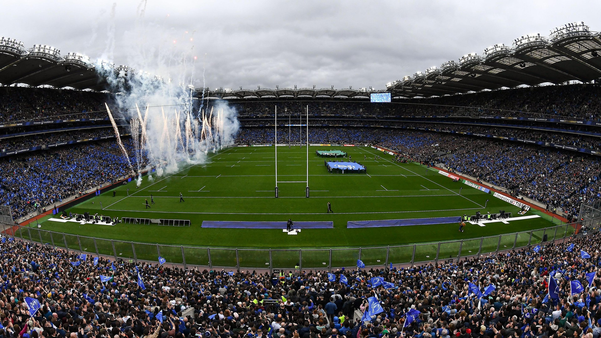
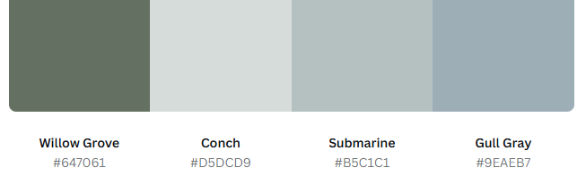
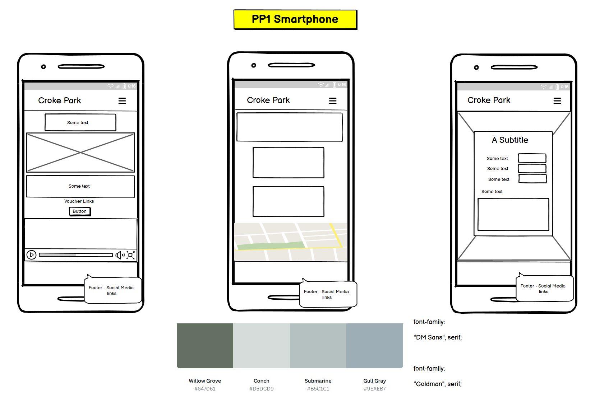
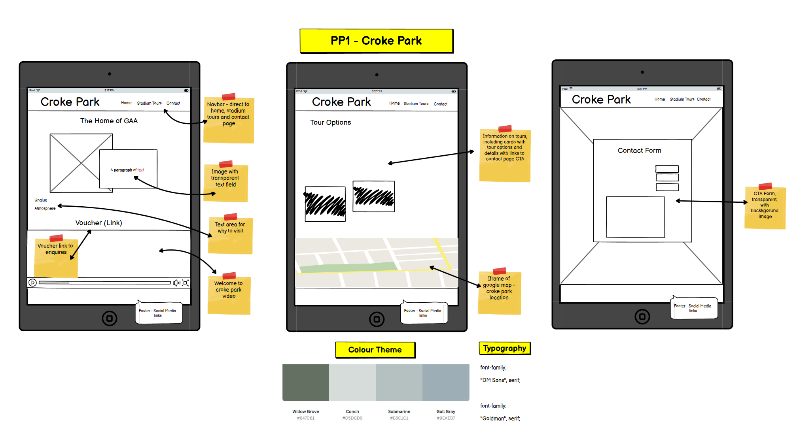
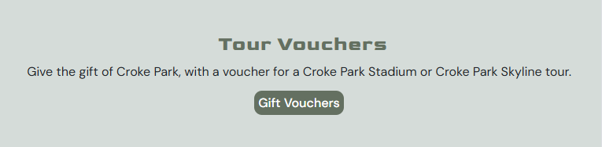
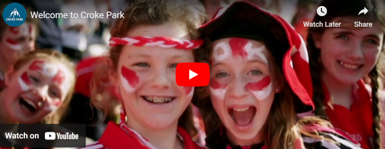
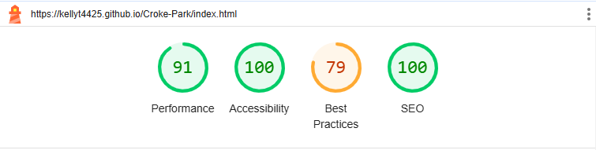

# **CROKE PARK** - The Home of Gaelic Football

>[**View my Project on GitHub - HERE**](https://github.com/KellyT4425/Croke-Park.git)  
[**Deploy Website - HERE**](https://kellyt4425.github.io/Croke-Park/) 

## **Project Description**

This project is aimed at providing users with an informative website that allows them to find out information on Croke Park Stadium, and what makes the home of GAA so special with its famous <strong>atmosphere</strong> and <strong>unique</strong> voluntary community. The communtiy that surrounds Gaelic Football is based off of dedication and a pure love for the sport. The players, managers and coaches recieve no reward for their time and effort, there only goal is to play the game they and their supporters are so passionate about and win the All-Irelands.

The website is also aimed at providing users detailed options to tour the grounds of Croke Park along with its Museum and its stunning Skyline panorama which can be seen 17 stories up. An option to also enquire about gift vouchers is available for those who want to gift a friend or loved one to the spectaular sight that is Croke Park. A **CTA** page was also included that allows users to reach out, or find out more about the tours and all Croke Park has to offer.

### **Technology Stack**
This Project used various technologies to make it presentable, functional and user friendly. 
  **Frontend Framework**
>HTML 5 
>CSS 3 
>Bootstrap v5.3 

## **Styling**

### **Typography**
Two font families where selected to add style to the project, DM Sans, serif was picked for the body of the content and Goldman, serif was picked for all headings. [**Google Fonts**](https://fonts.google.com/) was used to refine my search for the kind of style I felt would be suited to the over all presentation of the project which would go with the theme and also visually appealing to user's.  
>font-family:  "DM Sans", serif;  
 

>font-family:  "Goldman", serif;

### **Colour Scheme**

[**Canva**](https://www.canva.com/colors/color-palette-generator/) colour palette generator was used to select the colour scheme, the background image of the websites contact page was used to allow *Canva* to generate colours which would match the colours in imagery.

### **Imagery**
[**Adobe Express**](https://new.express.adobe.com/) was used to edit images, mostly for pixels and resolution especially for responsing to responsive design. All images used for the website can be found in images folder attached in the respository.
>[**Font Awesome**](https://fontawesome.com/) was used to provide the website's icons and favicon

### **Wireframes**
In the preparation stage of this project wireframes where created to provide visual aid to how the website should look and what features and functions it should have in order to meet its purpose. [**Balsamiq**](https://balsamiq.com/?gad_source=1&gclid=Cj0KCQiAy8K8BhCZARIsAKJ8sfTQzFLDPDxMbsgk-9un-aJDk1xvFlZdENGLQvV-c8Qv2NDKX6_d-T0aAjBaEALw_wcB) was used to create the below wireframes. 

## **Features** 
### Navigation
* At the top of the page there is the websites main header <strong>Croke Park</strong> to the left and to the right is three navigation links.
* The three navigation links direct the user to all pages such as Home, Tours and Contact pages.
* The background colour is set to a willow grove green and the main header and navigation links are a couch off white colour. 

 

[Visit Home Page](https://kellyt4425.github.io/Croke-Park/index.html)

### Vouchers
* Within the main body of the home page there is a link, this allows users to natigate directly from the home page to the tours page where they can find out more information on available vouchers.

 

[Visit Home Page](https://kellyt4425.github.io/Croke-Park/index.html)

### Media
* At the bottom of the homepage, above the footer there is video media, called Welcome to Croke Park. This video provides users with a quick snapshot of ariel footage of Croke Park and some of its main highlights.

 

[Visit Home Page](https://kellyt4425.github.io/Croke-Park/index.html)

### Tour Options
* On the tours page, users are able to view a number of tour cards that provide information on tours available, the length and cost of the tour. Below the cards is a link to navigate the user directly to the contact page.

 

[Visit Tours Page](https://kellyt4425.github.io/Croke-Park/tours.html)

### Map
* After the users have viewed tour options on the tour page, they can easily view the location of the stadium,
 at the bottom of the page there is an embedded google maps iframe which pinpoints Croke Park location.

 

[Visit Tours Page](https://kellyt4425.github.io/Croke-Park/tours.html)

### Contact
* On the contact page, there is a enquire now form which requires the user to provide details such as first and last name, along with an email address. There is also a message text area which is required to submit the form. The page has a main background image of an ariel view of Croke Park.

 

[Visit Contact Page](https://kellyt4425.github.io/Croke-Park/contact.html)

### Footer 
* At the bottom of the page there is a footer which has four social media links which directs the users to different social media platforms. These links open in a new browser tab.

 

[Visit Contact Page](https://kellyt4425.github.io/Croke-Park/contact.html)

 
## **Testing and Validation**

1. **HTML 5 and CSS 3 Validators** where used to check for any coding errors. 

[HTML 5 Validator](https://validator.w3.org/#validate_by_input) 

While validating the tours page, in the HTML 5 Validator I came accross errors which where not visable on reviewing the html code. The home page and contact page came bad free of errors.
 

 
[**CSS3 Valitdator**](https://jigsaw.w3.org/css-validator/#validate_by_input) 
No errors where found while validating the CSS Stylesheet.

2. Chrome Dev Tools and its Lighthouse Tool for Analysing website **performance, accessibility, best practices and SEO**. Responsive design for all device sizes was also tested in Chrome Dev Tools. 

 

 

 

3. [**WAVE**](https://wave.webaim.org/) web accessibility evaluation tool was also used to check that the web content was accessible to individuals with disabilities. 

4. Website navigation was also tested by ensuring all anchors/navigation links are responsive and working. Images, video's where given an alternative text and that it displays if an image or video does not load.

5. Contact form was also tested, to ensure adequate information is required to submit the form and that the form is submittable.

## **Bugs**

### Unsolved Bugs 
* **Navigation**  
Throughout the project I found that my nav toggle label pulls to the left on the home page and contact page, when using mobile dimensions. I have attempted to rectify this on numberious occasions but to no avail. I feel that at this time I currently lack the necessary skills required and as I progress and widen my knowledge I plan to revisit and fix any bugs that I was unable to resolve at this time. I also found that the navigation links on tablet and up move off position, rising and lowering on different screen widths.  

* **Tour Cards/Responsive Design** 
When adding the cards on the tour page, a [Bootstrap](https://getbootstrap.com/docs/5.3/components/card/) component was used along with adding rules for Column Size and Spacing to the code within the HTML file, such as for example <em>sm-col-6, md-col-6</em>. I have found Bootstrap difficult to work with as a beginner but as my learning continues and my knowledge grows I intend to return and rectify any bugs and errors. Especially in relation to media queries.  

## **Future Features** 

### Contact Page Form
On submitting the form on the contact page, it navigates to a new page acknowledging submission and thanking the user for there enquiry.

## **Credits**

### Content
* [Stack Overflow](https://stackoverflow.com/)   
* [Croke Park](https://crokepark.ie/)  
* [Bootstrap](https://getbootstrap.com/docs/5.3/)

### Media
* The background image used on the Contact Page was taken from [Indagare Travel](https://indagare.com).  
* The image displayed in my README was taken from the [BBC](https://www.bbc.co.uk/).  
* The stadium tour and museum images for tour page cards was taken from [Dublin Sight Seeing](https://www.dublinsightseeing.ie/things-to-do-in-dublin/attractions/croke-park-museum-skyline-tour).  
* The skyline tour image was taken from [Tripadvisor](https://www.tripadvisor.co.uk/).  
* [Voucher Image](https://brightonballetschool.co.uk/).  
* Help and guidance was provided from the Slack community, tutors and my mentor from Code Institute.  
* Main content image on the home page was taken from [My Kids Time](https://www.mykidstime.com/) . 
* The video on the Home page was taken from this [Youtube](https://www.youtube.com/@PaircAnChrocaigh) channel.  
* iframe for Croke Park location was taken from [Google Maps](https://www.google.ie/maps/place/Croke+Park/@53.360751,-6.2537091,17z/data=!3m1!4b1!4m6!3m5!1s0x48670e639264f995:0xe51347860e88b45f!8m2!3d53.3607478!4d-6.2511342!16zL20vMDF2cXcx?entry=ttu&g_ep=EgoyMDI1MDIwNS4xIKXMDSoASAFQAw%3D%3D).

